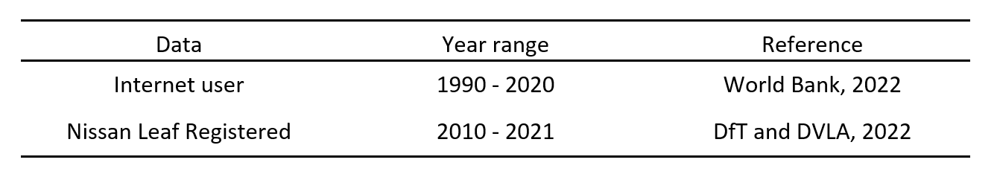

https://github.com/Masa0817/UCL-ESDA-dissertation-bass-diffusion-model
Проверять на обновления, проект новый, постоянно обновляется

# ESDA dissertation: Bass Diffusion Model
This is a data analysis that I conducted as part of my MSc dissertation in Energy Systems and Data Analytics at University College London (UCL).

## Description
The aim of the present analysis is to determine the AV penetration rate in the United Kingdom (UK). To achieve this objective, the bass diffusion model, which is one of the commonly used techniques for projecting the adoption of new and innovative technologies, was employed. This model is characterised by the innovation coefficient (*p*), imitation coefficient (*q*), and market size (*M*), which are essential in estimating the penetration rate. The innovation coefficient represents the proportion of early adopters that are influenced by the market size, while the imitation coefficient is a parameter that measures the rate of imitators influenced by word-of-mouth and media.

Prior research has suggested that AVs would be introduced into the market between 2025 and 2030, and that the Bass diffusion model is a popular technique for forecasting their adoption. Thus, this study follows this trend.

## Data
When quantifying the diffusion rate of AVs, the lack of actual data on AV sales or licensed vehicles presents a challenge. Instead, alternative data sources, such as sales of the Nissan Leaf electric vehicle and Internet user data in the UK, will be employed. The rationale for selecting these sources is that Internet penetration data can demonstrate how innovative products diffuse in the UK ([World Bank, 2022](https://datacommons.org/place/country/GBR?utm_medium=explore&mprop=count&popt=Person&cpv=isInternetUser%2CTrue&hl=en)). However, it should be noted that even in 2050, AVs are expected to be more expensive than Internet use. Furthermore, the objective of estimating the diffusion rate is to forecast the vehicle stock, and therefore, the actual number of licensed vehicles is utilized to ensure the analysis remains rooted in reality. As EVs are still in the development phase, EV data is chosen as a proxy for AVs, and the Nissan Leaf is selected as it represents a standard EV model used in the UK ([DfT and DVLA, 2022](https://www.gov.uk/government/statistical-data-sets/vehicle-licensing-statistics-data-tables)). The data for the Bass diffusion model is sourced from [Lavasani et al. (2016)](https://journals.sagepub.com/doi/10.3141/2597-09).

The following section presents a summary of the historical data. It is worth noting that the varying time ranges of the data will not pose a problem, as they will be utilized separately in the Bass model.

